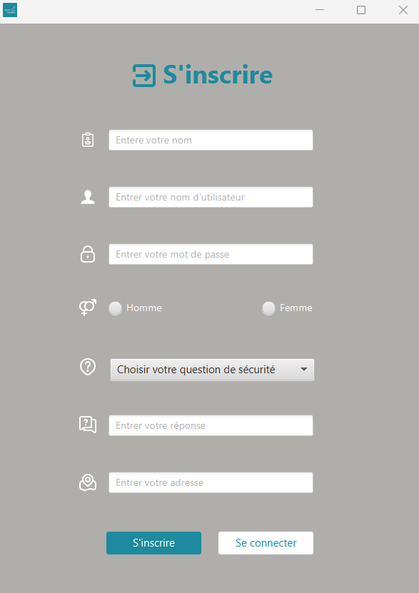

# App-javafx-gestion-hotel

Une application desktop JavaFX de gestion des tâches d'un réceptionniste d'hôtel.

A desktop JavaFX application for hotel receptionist task management.

---

## Description

Cette application permet de gérer les opérations quotidiennes d'un hôtel, incluant :
- Gestion des chambres
- Enregistrement des clients (check-in/check-out)
- Génération de factures et paiements
- Tableau de bord administratif

This application allows managing daily hotel operations, including:
- Room management
- Client registration (check-in/check-out)
- Invoice generation and payments
- Administrative dashboard

---

## Fonctionnalités / Features

### 🔐 Authentification / Authentication
- Connexion sécurisée / Secure login
- Inscription des utilisateurs / User registration
- Validation des informations / Information validation

### 🏨 Gestion des Chambres / Room Management
- Ajout de nouvelles chambres / Add new rooms
- Liste et gestion des chambres / Room list and management

### 📋 Check-in / Check-out
- Enregistrement des arrivées / Guest arrivals registration
- Tri et recherche des enregistrements / Sort and search records
- Gestion des départs / Departure management

### 💰 Facturation / Billing
- Génération de factures / Invoice generation
- Export PDF des factures / PDF invoice export
- Gestion des paiements / Payment management

---

## Captures d'écran / Screenshots

### Authentification / Authentication

| Connexion / Login | Inscription / Sign Up |
|:-:|:-:|
|  |  |

| Formulaire d'inscription / Sign Up Form | Inscription réussie / Successful Registration |
|:-:|:-:|
|  |  |

| Erreur de mot de passe / Password Error | Erreur d'inscription / Sign Up Error |
|:-:|:-:|
|  |  |

### Tableau de bord / Dashboard

| Accueil / Home | Dashboard |
|:-:|:-:|
|  |  |

### Gestion des Chambres / Room Management

| Liste des chambres / Room List | Ajouter une chambre / Add Room |
|:-:|:-:|
|  |  |

### Check-in

| Gestion des check-in / Check-in Management | Formulaire de check-in / Check-in Form |
|:-:|:-:|
|  |  |

| Check-in réussi / Successful Check-in | Tri des check-in / Sort Check-ins |
|:-:|:-:|
|  |  |

### Check-out

| Gestion des check-out / Check-out Management | Liste des check-out / Check-out List |
|:-:|:-:|
|  |  |

### Facturation / Billing

| Factures / Invoices | Paiement / Payment |
|:-:|:-:|
|  |  |

| Facture PDF / PDF Invoice |
|:-:|
|  |

---

## Technologies utilisées / Technologies Used

- **Java** - Langage de programmation / Programming language
- **JavaFX** - Framework d'interface utilisateur / UI framework
- **CSS** - Styles de l'interface / Interface styling

---

## Prérequis / Prerequisites

- Java JDK 11 ou supérieur / Java JDK 11 or higher
- JavaFX SDK

---

## Installation

1. Clonez le dépôt / Clone the repository:
   ```bash
   git clone https://github.com/Zaineb08/App-javafx-gestion-hotel.git
   ```

2. Ouvrez le projet dans votre IDE préféré (IntelliJ IDEA, Eclipse, NetBeans) / Open the project in your preferred IDE

3. Configurez JavaFX dans votre IDE / Configure JavaFX in your IDE

4. Exécutez l'application / Run the application

---

## Auteur / Author

**Zaineb08**

---

## Licence / License

Ce projet est sous licence libre / This project is open source.
